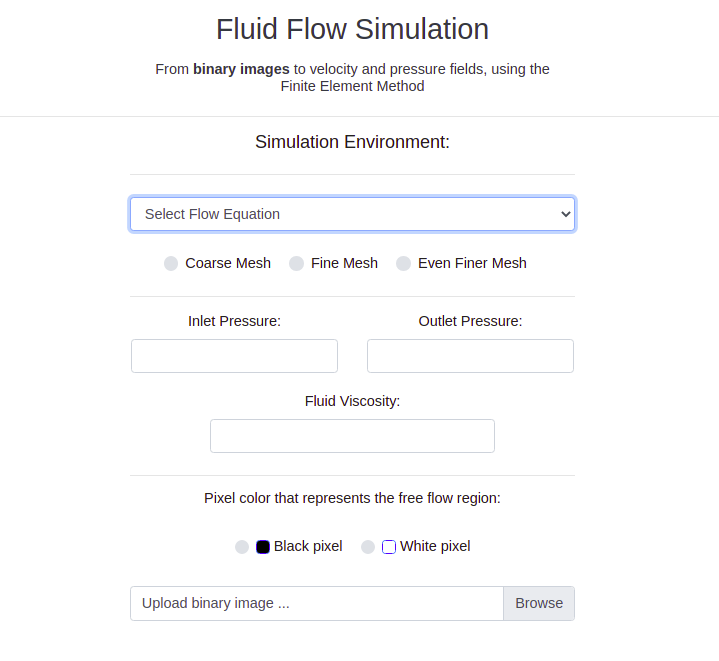
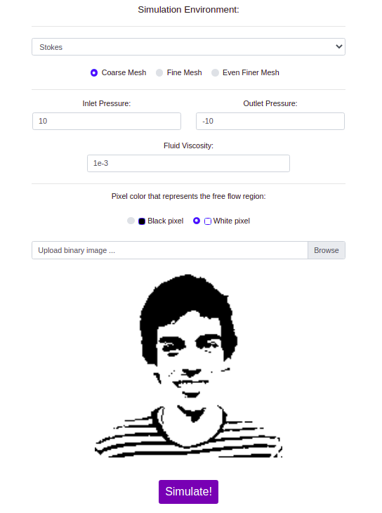
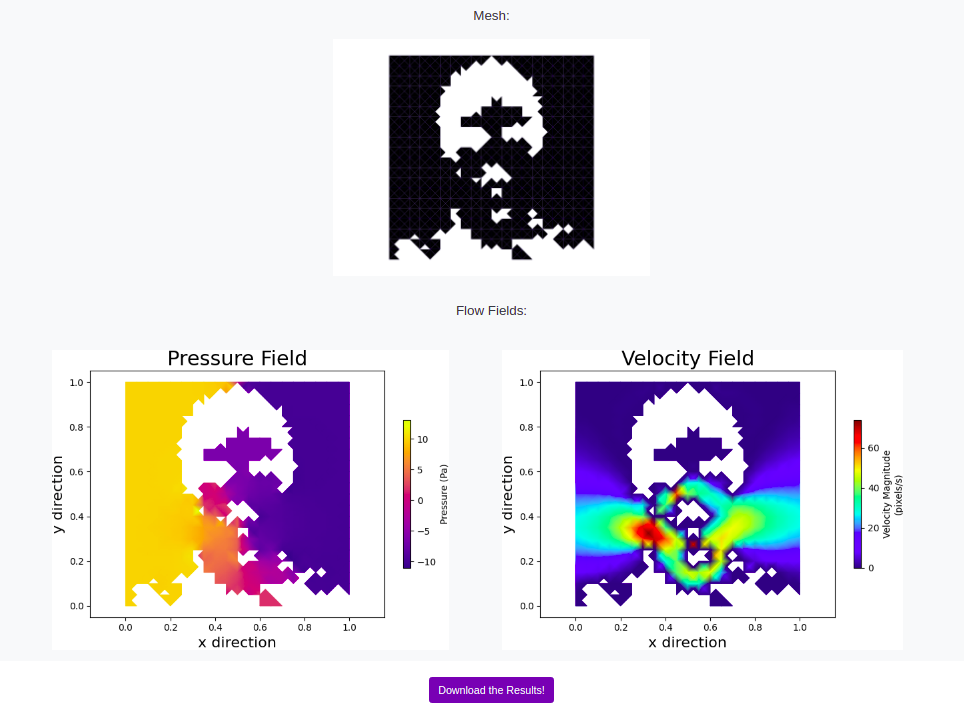
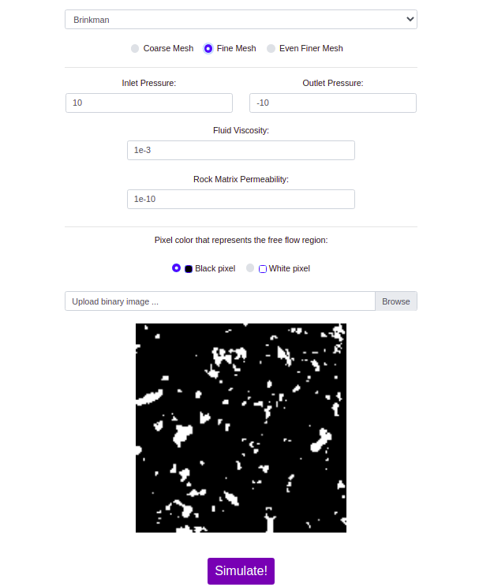

# FlowSolver-APP
### About
* FlowSolver-APP is an application that solves velocity and pressure fields equations of binary images using the Finite Element Method.
Currently the fluid flow can be describe using Stokes equation <a href="https://en.wikipedia.org/wiki/Stokes_flow">[1]</a> or Brinkman equation <a href="https://en.wikipedia.org/wiki/Darcy%27s_law#Brinkman_form_of_Darcy's_law">[2]</a>.

### How to install the dependencies
#### Globally
* Make sure that you have python3 installed in your computer
* Install the required packages in requirements.txt with the following command `pip3 install -r requirements.txt`
* Install the FeniCS plataform <a href="https://fenicsproject.org/download/">[3]</a>.

#### Docker

### Libraries Use
* FEniCS - The Fenics plataform is a open-source project for solving partial differential equations. The simulator made available in this page uses the Fenics plataform to generate the structured mesh and also to solve the discretized problem within the Finite
Element Method.
* Flask - Used as the web framework to execute the simulation and render the static/dynamic templates.
* Matplotlib - Used to generate the velocity/pressure field plots.
* scikit-image - Used to manipulate the input binary images.

### Screenshots
#### Blank Form

    

 

## Stokes Form

  
   

 

## Brinkman Form

 

  
   

